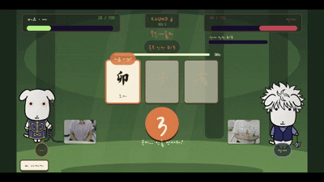

# 나루도 (Narudo) · GANADI

> **웹캠으로 진짜 손을 써서 12지신 인장(印)을 맺어 싸우는 1:1 실시간 대전 웹게임**
> 몰입캠프 26s-w4-c1-05 · 2인 / 6일 프로젝트

<!-- ⚠️ img/demo.gif 파일이 아직 없어 지금은 깨진 이미지로 보입니다.
     시연 영상에서 5초(손 인장 → 술법 발동)를 잘라 img/demo.gif 로 넣어주세요. -->


<p align="center">
  
  
  
  
  
  
</p>

---

## 📖 목차

1. [프로젝트 개요](#-프로젝트-개요)
2. [팀원 소개](#-팀원-소개)
3. [기능 명세서](#-기능-명세서)
4. [아키텍처](#-아키텍처)
5. [기술 스택](#-기술-스택)
6. [손 인식 파이프라인](#-손-인식-파이프라인-프로젝트의-심장)
7. [폴더 구조](#-폴더-구조)
8. [환경 변수 & 시작하기](#️-환경-변수--시작하기)
9. [API / 소켓 이벤트 명세](#-api--소켓-이벤트-명세)
10. [데이터 모델 (스키마)](#-데이터-모델-스키마)
11. [모델 학습 파이프라인](#-모델-학습-파이프라인)
12. [회고 (KPT)](#-회고-kpt)

---

## 🎯 프로젝트 개요

**나루도(Narudo)** 는 키보드·마우스를 쓰지 않는 대전 게임입니다.
서버가 라운드마다 인술(忍術) 하나를 뽑아 **그 인술의 인(印) 순서**를 양쪽 화면에 동시에 띄우면,
두 플레이어는 웹캠 앞에서 **실제 손으로 십이지 인장을 순서대로 맺습니다.**
먼저 시퀀스를 완성한 쪽이 술법을 발동해 상대 체력을 깎고, 체력이 0이 되면 승부가 끝납니다.

### 왜 이 구조인가

| 설계 결정 | 이유 |
| --- | --- |
| **인식은 100% 클라이언트에서** | MediaPipe·TF.js 모두 브라우저 WASM/GPU 추론. GPU 서버가 필요 없고, 영상이 서버로 나가지 않는다. |
| **서버엔 "완성했다"만 보낸다** | 승자는 `round:complete` 이벤트의 **서버 수신 순서**로 결정. 좌표 동기화·롤백이 없으니 넷코드 난이도가 사실상 0. |
| **영상(WebRTC)과 판정(Socket.IO) 완전 분리** | 화상이 NAT에 막혀 죽어도 게임 판정에는 아무 영향이 없다. 화상은 "소통 전용"으로 격리. |
| **인식기를 교체 가능 모듈로 고정** | `recognizer.js`는 내부 구현과 무관하게 `onSeal(sealId, confidence, timestamp)`만 발행. 룰 기반 → 센트로이드 → MLP로 두 번 갈아끼우는 동안 게임 코드는 한 줄도 안 바뀌었다. |
| **"도감 12종, 실전 N종"** | 인식률이 안 나오는 인장은 **시퀀스 생성에서만** 제외. 도감·연출에는 12종 전부 등장하므로 사용자에겐 실패율이 보이지 않는다. (최종적으로 12종 전부 실전 투입 성공) |

### 성공 기준 (Day 6 종료 시점)

- [x] 서로 다른 PC 2대가 방 코드로 매칭 → 대전 1판 완주
- [x] 십이지 12종이 도감·연출에 전부 등장, 실전 시퀀스에도 12종 전부 투입
- [x] 상대 얼굴/손이 보이는 P2P 화상 (판정과 무관)
- [x] 캐릭터 선택 → 대전 → 승패까지 완결된 플로우
- [x] 서버가 죽어도 도는 오프라인 연습 모드 (시연 안전망)

---

## 👥 팀원 소개

<table>
  <tr>
    <td align="center" width="240">
      <a href="https://github.com/yxxnxyxxn">
        
      </a>
    </td>
    <td align="center" width="240">
      <a href="https://github.com/seooyy">
        
      </a>
    </td>
  </tr>
  <tr>
    <td align="center"><b>유나연</b></td>
    <td align="center"><b>정서영</b></td>
  </tr>
  <tr>
    <td align="center"><a href="https://github.com/yxxnxyxxn">@yxxnxyxxn</a></td>
    <td align="center"><a href="https://github.com/seooyy">@seooyy</a></td>
  </tr>
  <tr>
    <td align="center"><b>B — 네트워크 · 게임/화면</b></td>
    <td align="center"><b>A — 인식 · 데이터/모델</b></td>
  </tr>
  <tr>
    <td align="center">
      Node 서버(방 · 심판 상태 머신)<br/>
      Socket.IO 프로토콜 · PeerJS 화상<br/>
      Phaser 씬 전체 · 두루마리 UI 테마<br/>
      인술 시스템 · 속성 발사체 이펙트 · 배포
    </td>
    <td align="center">
      MediaPipe 파이프라인 · 프레임 루프<br/>
      수집/라벨링 툴 · 특징 설계(v1/v2)<br/>
      센트로이드 → MLP 학습 · 임계값 튜닝<br/>
      인식 게이지 · 연습 모드
    </td>
  </tr>
</table>

> 인터페이스 계약(`onSeal`)을 **Day 1 마지막 1시간에 확정**한 덕에 Day 2~3을 완전 병렬로 작업했습니다.

---

## ✅ 기능 명세서

### 필수 기능 (MVP)

- [x] **웹캠 손 인식** — MediaPipe Hand Landmarker로 두 손 42개 랜드마크 실시간 추출
- [x] **십이지 인장 판별** — 182차원 쌍거리 특징 + 13클래스 소형 MLP (인장 12 + `none`)
- [x] **인장 확정 로직** — 시간축 다수결(270ms) → 0.4초 홀드 → 엣지 트리거 1회 발행
- [x] **방 생성 / 4자리 코드 입장 / 2인 매칭**
- [x] **서버 권위 라운드 심판** — 시퀀스 배포 → 수신 대기 → 판정 → 데미지 브로드캐스트 → 다음 라운드
- [x] **라운드 제한시간 30초** — 아무도 못 끝내면 무승부로 다음 라운드. 인식이 미끄러져도 화면이 멈추지 않는다
- [x] **HP 100 · 시퀀스 길이 비례 데미지** — 체력 0 시 매치 종료
- [x] **캐릭터 선택 (4종)** — 스탯 동일, 스킨만 차이 (밸런싱 제거)
- [x] **대전 UI** — 인장 타일 열, 좌우 대칭 HP 바, 카운트다운, 상대 진행률 실시간 표시
- [x] **승패 연출 및 결과 화면**

### 선택 / 추가 기능

- [x] **인술(忍術) 시스템** — 라운드마다 실제 인술 10종 중 하나를 추첨, 그 인술의 인 순서가 곧 목표 시퀀스
- [x] **속성별 발사체 이펙트** — 불/물/땅/바람/번개 스프라이트시트. **패배 시엔 상대 술법이 나에게 날아와 피격**
- [x] **P2P 화상 통화** — PeerJS. 각 캐릭터 바로 옆에 웹캠 배치. 실패해도 게임은 무영향
- [x] **인장 도감** — 십이지 12종 카드 + 난이도 색상 + 클릭 시 실제 손동작 사진 팝업
- [x] **손 인식 준비 관문(HandCheck)** — 두 손바닥 1초 유지로 카메라·인식기 상태 사전 검증
- [x] **오프라인 연습 모드** — 서버·상대 없이 혼자 완주. 시연 중 서버가 죽어도 도는 안전망
- [x] **MediaPipe 자산 self-host** — WASM·모델을 로컬에서 먼저 찾고 없으면 CDN 폴백. 시연장 네트워크에 인식을 걸지 않는다
- [x] **인식 게이지** — "인식이 안 되는 것"과 "인식되는 중"을 구분해 보여주는 3상태 UI
- [x] **데이터 수집·라벨링 툴** (`hand-test/collector.html`) — 인장 선택 → 스페이스바 → 30프레임 연사 → JSON/ZIP 내보내기
- [x] **오프라인 평가 도구 체인** — 리플레이 · 혼동행렬 · 임계값 스윕 · 배포 아티팩트 스모크 테스트
- [x] **서버 회귀 테스트** (`npm run test:server`) — 실제 서버를 띄우고 붙어서 방 관리·판정을 검증하는 26개 시나리오
- [x] **이탈 시 몰수승 처리** · 대전 중 나가기
- [x] **한글/한자 분리 웹폰트 서브셋** — 쓰는 글자만 남겨 8.7MB(ttf) → 114KB(woff2 2종)
- [ ] 동시 커밋형 심리전 모드 (스트레치 — Day 6 게이트에서 컷)
- [ ] 캘리브레이션 씬 (기획엔 있었으나 미구현 — 골격만 있던 `CalibrationScene`은 이후 제거)
- [ ] 재접속 복구 (스코프 아웃 — 소켓 id가 바뀌면 서버가 방을 정리한다)
- [ ] 사운드 (인장 확정 · 술법 발동 · 승패 BGM)

---

## 🏗 아키텍처

```
        ┌──────────────────────── CLIENT A (브라우저) ──────────────────────────┐
        │                                                                       │
        │   [Webcam] ──getUserMedia──> <video #local-cam>                       │
        │       │                            │                                  │
        │       │                            ▼                                  │
        │       │            ┌───────── handTracker (앱 전역 싱글턴) ─────────┐  │
        │       │            │  rAF 루프 · 중복 추론 방지 · 30fps 상한        │  │
        │       │            │  (인식 불필요 씬에선 루프 정지)                │  │
        │       │            │      │                                         │  │
        │       │            │      ▼                                         │  │
        │       │            │  MediaPipe HandLandmarker (WASM / GPU)         │  │
        │       │            │      │  hands[2][21] landmarks                 │  │
        │       │            │      ▼                                         │  │
        │       │            │  featuresV2  손목정규화 + 쌍거리 → 182차원      │  │
        │       │            │      │                                         │  │
        │       │            │      ▼                                         │  │
        │       │            │  MLP (TF.js, 13-way softmax)                   │  │
        │       │            │      │  ACCEPT 0.80 / MARGIN 0.20              │  │
        │       │            │      ▼                                         │  │
        │       │            │  다수결(270ms) → 홀드(400ms) → 엣지 트리거     │  │
        │       │            └──────┬──────────────────────────┬─────────────-┘  │
        │       │        onSeal(id, conf, ts)          onFrame(state)            │
        │       │                   ▼                          ▼                 │
        │       │            ┌─────────────── Phaser 3 Scenes ───────────────┐   │
        │       │            │ Boot→CharSelect→HandCheck→Lobby→Battle→Result │   │
        │       │            └──────┬────────────────────────────────────────┘   │
        │       │                   │                                            │
        └───────┼───────────────────┼────────────────────────────────────────────┘
                │                   │
    ┌───────────┘                   │  Socket.IO (WSS)
    │  MediaStream                  │   ▲ round:start / result / timeout / match:over
    │                               ▼   │ round:complete / round:oppProgress
    │                    ┌─────────────────────────────────┐
    │                    │    NODE SERVER (Express + SIO)  │
    │                    │                                 │
    │                    │  rooms.js    방 Map · 코드 매칭   │
    │                    │  한 소켓 = 한 방 (불변식)         │
    │                    │      │                          │
    │                    │      ▼                          │
    │                    │  referee.js  라운드 상태 머신     │
    │                    │  대기→배포→수신→판정→브로드캐스트  │
    │                    │  30초 제한시간 · 완성 시간 검증    │
    │                    │      ▲                          │
    │                    │      │ shared/jutsu.js (인술 DB) │
    │                    │  peer:id 중계 (영상은 안 지나감)  │
    │                    └─────────────────────────────────┘
    │                               │
    │                               │ peer id 교환만
    │                               ▼
    │   ╔═══════════════════ WebRTC P2P (PeerJS) ═══════════════════╗
    └──>║  영상/음성 스트림은 서버를 거치지 않고 클라 ↔ 클라 직결     ║
        ║  실패해도 게임 판정에는 영향 없음 (완전 격리)               ║
        ╚═════════════════════════╤═════════════════════════════════╝
                                  ▼
        ┌──────────────────────── CLIENT B (브라우저) ──────────────────────────┐
        │                      (A와 완전히 동일한 스택)                          │
        └───────────────────────────────────────────────────────────────────────┘


   ── 오프라인 학습 파이프라인 (게임 런타임과 분리) ───────────────────────────

   hand-test/collector.html           tools/                   client/public/model/
   ┌─────────────────────┐   JSON   ┌───────────────────┐     ┌──────────────────┐
   │ 인장 선택 → 스페이스  │ ───────> │ trainMLP.mjs      │ ──> │ model.json       │
   │ 30프레임 연사 캡처    │  data/   │  증강 ×5          │     │ weights.bin      │
   │ landmarks + JPEG     │          │  클래스 가중치     │     │ labels.json      │
   └─────────────────────┘          │  홀드아웃 채점     │     └────────┬─────────┘
                                    │  --retry 붕괴 필터 │              │ fetch
                                    └────────┬──────────┘              ▼
                                             │              브라우저 런타임이 로드
                                    replay / mlpEval / smokeMLP
                                    (혼동행렬 · 임계값 스윕 · 배포 검증)
```

### 라운드 시퀀스 다이어그램

```
 Player A            Server (referee)              Player B
    │                      │                          │
    │  round:start { round, sequence, jutsu, timeLimitMs }
    │ <────────────────────┼────────────────────────> │
    │                      │  ⏱ 30초 타이머 시작       │
 [손으로 인 맺기]           │                   [손으로 인 맺기]
    │  round:oppProgress   │   round:oppProgress      │
    │ ────────────────────>│─────────────────────────>│  (중계만, 판정 무관)
    │                      │                          │
    │  round:complete ────>│  ← 서버 수신 순서 = 승부   │
    │                      │  ① 너무 빠르면 버림        │
    │                      │    (len × 400ms × 0.5 미만)│
    │                      │  ② roundResolved = true   │
    │                      │  ③ hp[loser] -= len × 8   │
    │  round:result { winner, damage, hp }             │
    │ <────────────────────┼─────────────────────────>│
    │                      │                          │
    │                 hp <= 0 ?                       │
    │        ├─ yes → match:over { winner }           │
    │        └─ no  → 2초 후 startRound()             │
    │                      │                          │
    │   ⏱ 30초 안에 아무도 완성 못 하면                  │
    │  round:timeout { round, hp }  ← 데미지 없이 다음   │
    │ <────────────────────┼─────────────────────────>│
```

---

## 🛠 기술 스택

### Frontend

| 역할 | 기술 | 비고 |
| --- | --- | --- |
| 게임 엔진 | **Phaser 3.90** | 7개 씬, 트윈 · 파티클 · 스프라이트시트 애니메이션 |
| 번들러 | **Vite 5.4** | LAN 노출(`host: true`)로 실기기 대전 테스트 |
| 손 추적 | **@mediapipe/tasks-vision 0.10** | Hand Landmarker, `numHands: 2`, GPU delegate, VIDEO 모드. WASM·모델은 로컬 우선 · CDN 폴백 |
| 추론 | **TensorFlow.js 4.22** | `tfjs-core` + `tfjs-layers` + `tfjs-backend-webgl`만 임포트. 메타패키지를 쓰면 안 쓰는 조각까지 딸려와 번들이 350KB 커진다 |
| 화상 | **PeerJS 1.5 (WebRTC)** | glare 방지: 입장한 쪽만 `call`, 만든 쪽은 `answer` |
| 통신 | **socket.io-client 4.8** | 단일 소켓 인스턴스 공유 |
| 렌더링 | Canvas 2560×1440 (`RENDER_SCALE 2`) → FIT 다운스케일 | 좌표계는 1280×720 유지, 텍스트 선명도 확보 |

### Backend

| 역할 | 기술 | 비고 |
| --- | --- | --- |
| HTTP | **Express 4.22** | `/health` 헬스체크 하나 (게임 로직은 전부 소켓) |
| 실시간 | **Socket.IO 4.8** | 방 · 매칭 · 심판 · 시그널링 중계. CORS는 `CORS_ORIGIN`으로 제한 |
| 런타임 | **Node.js (ESM)** | `node --watch`로 개발, 무상태 인메모리 |

### Data / ML

| 역할 | 기술 | 비고 |
| --- | --- | --- |
| 특징 | 손목 기준 정규화 + **쌍거리 행렬** | v1 90차원(센트로이드) / **v2 182차원**(MLP, PIP 관절 포함) |
| 분류기 | `Dense(64,relu) → Dropout(0.2) → Dense(32,relu) → Dense(13,softmax)` | Adam(5e-3), 200 epochs, batch 32 |
| 증강 | 손목 축 3D 회전(yaw/pitch) + 가우시안 지터, ×5 | ⚠️ 평행이동 · 스케일은 쌍거리 특징상 무효 (측정 오차 1e-15) |
| 폴백 | 최근접 센트로이드 (v1 특징) | `recognizer.js`의 `USE_MLP = false` 한 줄로 즉시 복귀 |

### Infrastructure

| 역할 | 기술 |
| --- | --- |
| 모노레포 | npm workspaces (`client` / `server`) + 공유 `shared/` |
| 배포 | **Cloudflare Tunnel** — `narudo.madcamp-kaist.org` (클라) · `api.narudo.madcamp-kaist.org` (서버) |
| 필수 조건 | **HTTPS** (`getUserMedia` 제약 — localhost 예외) |
| 테스트 | `npm run test:server` — 실제 서버를 띄워 붙는 회귀 시나리오 26개 |

---

## 🔬 손 인식 파이프라인 (프로젝트의 심장)

> 십이지 인장은 두 손을 깍지 껴 맞물리기 때문에, **구별의 핵심 정보(어떤 손가락이 위/아래인가)가 손 안쪽에 가려집니다.**
> MediaPipe는 안 보이는 부분을 추측해 채우므로 "데이터를 모아도 입력에 정보가 없는 케이스"가 남습니다.
> 이 문제를 뚫기 위해 실제로 밟은 경로를 그대로 기록합니다.

### 1) 인장 난이도 분류

| 유형 | 예시 | 난이도 | 결과 |
| --- | --- | --- | --- |
| 수평 교차형 | 개, 원숭이 | 쉬움 — 실루엣이 완전히 다름 | 초기부터 안정 |
| 세로 + 손가락 돌출형 | 호랑이, 말, 쥐, 토끼, 양, 닭 | 중간 — 돌출 손가락으로 구분 | 데이터 확보 후 안정 |
| 완전 맞물림형 | 뱀, 멧돼지, 용, 소 | **어려움** — 돌출 없이 안쪽 배열만 다름 | 2손 자세 재수집으로 해결 |

### 2) 분류가 아니라 "검증"으로 문제를 바꾼다

스피드 모드에선 **목표 시퀀스가 이미 화면에 떠 있습니다.** 시스템이 답할 질문은
"12개 중 뭐냐"가 아니라 **"지금 이게 목표 인장 X 맞냐"** 입니다. 12-way 분류가 이진 검증으로 바뀌면 난이도가 크게 떨어집니다.
대신 "대충 비슷한 포즈로 통과"를 막기 위해 **런너업 마진**을 겁니다 — 1등 확률이 2등보다 `MARGIN` 이상 앞설 때만 인정.

### 3) 거의 공짜로 정확도를 올린 것들

| 기법 | 효과 |
| --- | --- |
| **쌍거리 특징** | 원시 좌표 대신 랜드마크 쌍의 거리 행렬 → 맞물림 구조를 훨씬 잘 인코딩. 위치 · 스케일 불변 |
| **손목 기준 정규화** | 손이 화면 어디에 있든, 카메라에서 얼마나 멀든 같은 포즈면 같은 값 |
| **PIP 관절 추가 (v1→v2)** | 교차 세션 정확도 **60.7% → 69.1%** (5회 평균, 분포 겹침 없음). DIP까지 넣으면 오히려 하락 |
| **시간축 다수결 (270ms)** | 단발 오인식 소멸. 프레임 수가 아니라 ms로 정의해 추론 fps를 바꿔도 체감 반응이 그대로다 |
| **0.4초 홀드 + 엣지 트리거** | 같은 홀드에서 두 번 발행되는 것 방지 |
| **홀드 구간 최고 confidence 채택** | 확정 순간의 프레임이 하필 거부된 프레임일 때 "confidence 0"이 발행되는 거짓 신호 제거 |
| **손 개수별 센트로이드 분리** | 한 인장 안에 1손/2손이 섞이면 평균이 어느 무리에도 속하지 않는 허공의 점이 됨 (호랑이가 실제로 붕괴) |

### 4) 데이터 수집을 6일 내내 분산한 이유

하루에 몰아 찍으면 **그날의 조명 · 옷 · 카메라 위치가 데이터에 통째로 각인**되어 다른 날 무너집니다.
며칠에 나눠 찍으면 그 분산이 공짜로 데이터셋에 들어갑니다. 그래서 Day 1~5에 걸쳐 5개 세션을 수집했습니다.

```
seals_2026-07-25_360f_360img   1차
seals_2026-07-27_420f_420img   2차 (다른 조명/시간대)
seals_2026-07-28_120f_120img   3차 (표적 보강)
seals_2026-07-28_390f_390img   ★ 제3자 세션 = 시험지 (학습에 절대 넣지 않음)
seals_2026-07-29_240f_240img   4차 (2손 자세 + none 180장 보강)
```

> **"근거는 언제나 제3자 손이다."**
> 팀원 손으로 잘 되는 건 시험 문제를 미리 보고 친 시험이라 근거가 되지 못합니다.
> 학습에 없는 세션을 홀드아웃(시험지)으로 고정하고, 거기서 나온 성적만 성적으로 셌습니다.

### 5) 측정으로 얻은 교훈 (숫자로 남긴 것들)

| 발견 | 내용 |
| --- | --- |
| **센트로이드 → MLP** | 같은 교차 세션 조건에서 33.8% → 65.9%. 특징 v2 적용 후 추가 상승 |
| **임계값으로는 못 막는 오탐이 있다** | ACCEPT 0.5~0.95 × MARGIN 0.2~0.8 **24개 조합 전부 오탐률 동일.** 오탐하는 `none` 샘플이 확신도 1.00으로 들어오기 때문. → 임계값을 조이면 오탐은 그대로고 정상 인장만 죽는다. 해결책은 `none` 다양성 수집뿐 |
| **오염된 `none`을 걸러내야 한다** | "인장을 맺다 만 중간 자세"를 `none`으로 찍으면 특징 공간에서 완성 인장과 이어져 **인장 하나를 통째로 `none`에 내주는** 붕괴가 발생. 인장별 중앙거리 기준으로 침범 샘플을 자동 제거 |
| **클래스 불균형이 인장을 죽인다** | `none`이 인장 평균의 2.7배(210 vs 78)가 되자 dog · horse가 0%로 붕괴. 클래스 가중치로 해결 |
| **가중치 초기화는 시드에 안 걸린다** | 같은 명령을 8번 돌리면 그중 5번은 인장 하나가 `none`에 먹힌 모델이 나온다. → **`--retry=8`로 홀드아웃 채점해 붕괴 없는 모델만 저장** |
| **양(goat) 부활기** | 7/28엔 0%/100%를 오가며 흔들려 실전에서 뺐다가, 7/29에 2손 자세 60장 + `none` 180장을 재수집해 재학습하니 배포 모델에서 30/30 · 확신도 1.00으로 안정. monkey · snake · rooster가 앞서 걸어간 것과 같은 경로 → **최종적으로 12종 전부 실전 투입** |

---

## 📁 폴더 구조

```
GANADI/
├── client/                              # Phaser 3 + MediaPipe + TF.js (Vite)
│   ├── index.html                       # 캔버스 + 웹캠 DOM 오버레이 + 웹폰트 정의
│   ├── vite.config.js                   # LAN 노출 · 터널 도메인 허용
│   ├── public/
│   │   ├── model/seal-mlp/              # ★ 배포 모델 (model.json · weights.bin · labels.json)
│   │   ├── model/hand-landmarker/       # MediaPipe 모델 self-host (gitignore · vendor 스크립트로 생성)
│   │   ├── mediapipe/wasm/              # MediaPipe WASM self-host (gitignore · 동상)
│   │   ├── characters/                  # 가나디 캐릭터 스프라이트 4종
│   │   ├── effects/                     # 속성별 발사체 스프라이트시트
│   │   ├── board/                       # 인장 손동작 사진 (도감 팝업)
│   │   ├── gif/                         # 인장 손동작 gif (gitignore — 용량 큼, board가 폴백)
│   │   └── fonts/                       # 한글/한자 분리 서브셋 woff2
│   └── src/
│       ├── main.js                      # Phaser 부트스트랩 (폰트 로드 후 시작)
│       ├── config.js                    # 임계값 · 해상도 · 서버 URL (튜닝 단일 출처)
│       ├── scenes/
│       │   ├── BootScene.js             # 에셋 로드 + 웹캠 권한
│       │   ├── CharacterSelectScene.js  # 캐릭터 4종 선택
│       │   ├── HandCheckScene.js        # 손 인식 준비 관문 (두 손바닥 1초 홀드)
│       │   ├── LobbyScene.js            # 방 생성 / 코드 입장 / 연습 모드
│       │   ├── BattleScene.js           # 대전 본체 (온라인 + 연습 겸용)
│       │   ├── ResultScene.js           # 승패 연출
│       │   └── CodexScene.js            # 인장 도감 (12종 + 손동작 팝업)
│       ├── recognition/
│       │   ├── handTracker.js           # ★ rAF 프레임 루프 · 앱 전역 싱글턴 · fps 상한 · pause/resume
│       │   ├── handLandmarker.js        # MediaPipe 래퍼 (로컬 자산 우선 · CDN 폴백)
│       │   ├── recognizer.js            # ★ onSeal 계약 · 다수결 · 홀드 · 엣지 트리거
│       │   ├── features.js              # 특징 v1 (90차원) — 센트로이드용
│       │   ├── featuresV2.js            # 특징 v2 (182차원) — MLP용
│       │   ├── mlpModel.js              # TF.js 모델 로드 · 추론 · 거부 판정
│       │   ├── classifyCentroid.js      # 최근접 센트로이드 (폴백 경로)
│       │   └── centroids.js             # ⚠️ 자동 생성 파일 (직접 수정 금지)
│       ├── net/
│       │   ├── socket.js                # Socket.IO 단일 인스턴스
│       │   └── webrtc.js                # PeerJS 화상 (게임과 격리)
│       ├── ui/
│       │   ├── theme.js                 # 숲속 두루마리 톤 · 색 토큰 · 그리기 헬퍼
│       │   └── holdGauge.js             # 인식 게이지 표시 로직 (순수 함수)
│       ├── data/
│       │   ├── seals.js                 # 십이지 정의 (한자 · 난이도)
│       │   ├── characters.js            # 캐릭터 4종
│       │   └── jutsu.json               # 인술 DB (자료용 사본 — 런타임은 shared/jutsu.js)
│       └── devtools/recognizerTest.js   # 브라우저 인식기 테스트 하네스
│
├── server/                              # Node + Express + Socket.IO
│   └── src/
│       ├── index.js                     # 진입점 (HTTP + Socket.IO · CORS)
│       ├── rooms.js                     # ★ 방 생성/입장/매칭/이탈 — "한 소켓 = 한 방" 불변식
│       └── referee.js                   # ★ 라운드 상태 머신 (서버 권위 판정 · 제한시간 · 치트 가드)
│
├── shared/                              # ★ 클라 · 서버 공유 SSOT
│   ├── constants.js                     # seal id · 소켓 이벤트명 · 룰 상수
│   └── jutsu.js                         # 인술 DB · 데미지 · 최소 완성시간 계산
│
├── tools/                               # 오프라인 학습 · 평가 · 운영 (Node 스크립트)
│   ├── trainMLP.mjs                     # ★ 학습 + 홀드아웃 채점 + 붕괴 필터
│   ├── makeCentroids.mjs                # 센트로이드 생성
│   ├── replay.mjs                       # 저장 데이터 리플레이 채점 · 임계값 스윕
│   ├── mlpEval.mjs                      # 교차 세션 실험
│   ├── imageEval.mjs                    # 픽셀 CNN 비교 실험
│   ├── smokeMLP.mjs                     # 배포 아티팩트 스모크 테스트
│   ├── testServer.mjs                   # ★ 서버 회귀 테스트 26개 (방 관리 · 판정 · 보안)
│   ├── vendorMediapipe.mjs              # MediaPipe WASM·모델 로컬 내려받기 (오프라인 시연용)
│   └── lib/                             # sessions · augment · handCrop
│
├── hand-test/                           # 데이터 수집 · 라벨링 툴 (독립 페이지)
│   ├── collector.html                   # 인장 선택 → 스페이스 → 30프레임 연사 → JSON/ZIP
│   └── recognizer.html                  # 실시간 인식 디버그 뷰
│
├── docs/                                # 기획안 · 화면 목업 6종
└── data/                                # 수집 세션 (gitignore — 용량 큼)
```

---

## ⚙️ 환경 변수 & 시작하기

### 요구 사항

- Node.js 18+
- 웹캠이 달린 데스크톱/노트북
- **HTTPS 또는 localhost** (`getUserMedia` 브라우저 정책)

### 환경 변수

**`client/.env`**

```bash
# Socket.IO 서버 주소 (미설정 시 http://localhost:3001)
VITE_SERVER_URL=http://localhost:3001
```

> ⚠️ **`VITE_SERVER_URL`은 런타임이 아니라 빌드 타임에 번들로 구워집니다.** 빌드한 뒤에는 못 바꿉니다.
> 배포용 빌드는 반드시 값을 준 채로 돌리세요 — 안 그러면 `localhost:3001`이 박힌 채로 배포됩니다.
> ```bash
> VITE_SERVER_URL=https://api.narudo.madcamp-kaist.org npm run build:client
> ```

**`server/.env`**

```bash
# 서버 포트 (미설정 시 3001)
PORT=3001

# CORS 허용 오리진 (콤마 구분). 미설정 시 전체 허용(*) + 시작 로그에 경고
CORS_ORIGIN=https://narudo.madcamp-kaist.org
```

### 실행

```bash
# 1. 의존성 설치 (루트 워크스페이스가 client/server를 함께 설치)
npm install

# 2. 서버 실행 → http://localhost:3001   (헬스체크: /health)
npm run dev:server

# 3. 클라이언트 실행 → http://localhost:5173
npm run dev:client

# 4. 프로덕션 빌드 (서버 주소를 함께 주입 — 위 경고 참고)
npm run build:client

# 5. 서버 회귀 테스트 (방 관리·판정을 건드렸다면 반드시)
npm run test:server
```

### 시연 전 준비 — MediaPipe 자산 로컬화

```bash
npm run vendor:mediapipe
```

WASM 런타임(node_modules에서 복사)과 손 랜드마커 모델(약 7.5MB 다운로드)을 `client/public/` 아래에 받아둡니다.
받아두면 **인터넷 없이도 손 인식이 뜹니다.** 브라우저 콘솔에서 `[landmarker] wasm=로컬 · 모델=로컬` 로 확인하세요.

> 자산은 합계 약 40MB라 git에 넣지 않습니다(`.gitignore`). 없으면 자동으로 CDN 폴백하므로
> 클론 직후에도 게임은 정상 동작하고, 다만 시연장 네트워크에 의존하게 됩니다.

### 데이터 수집 & 모델 재학습

```bash
# 수집 툴 실행 (인장 선택 → 스페이스바 → 30프레임 연사 → JSON 내보내기)
npm run collect            # http://localhost:5174/hand-test/collector.html

# 성적부터 확인 — 학습에 없는 제3자 세션을 시험지로
node tools/trainMLP.mjs --holdout=seals_2026-07-28_390f_390img
node tools/trainMLP.mjs --holdout=seals_2026-07-28_390f_390img --seed=2   # σ≈3~4%p라 3회는 봐야 한다

# 배포용 학습 — ★ --retry는 반드시 붙일 것
#   가중치 초기화가 시드에 안 걸려서 같은 명령도 매번 다른 모델이 나오고,
#   그중 상당수는 인장 하나가 통째로 'none'에 먹힌다. --retry가 그런 모델을 걸러낸다.
node tools/trainMLP.mjs --retry=8

# 배포 아티팩트 검증 (라벨 순서 밀림 · 매니페스트 어긋남을 5초 만에 잡는다)
node tools/smokeMLP.mjs

# 센트로이드(폴백 경로) 재생성 + 채점
node tools/makeCentroids.mjs
node tools/replay.mjs --sweep
```

### 게임 플레이 흐름

```
Boot(웹캠 권한) → CharacterSelect(4종) → HandCheck(두 손바닥 1초)
    → Lobby(방 만들기 / 코드 입장 / 혼자 연습)
        → Battle(카운트다운 → 인 맺기 → 판정 반복)
            → Result(승/패)
```

> 💡 **인식기가 없어도 데모는 돕니다** — 대전 씬에서 `Space`가 다음 목표 인장을 대신 확정합니다.

---

## 🔌 API / 소켓 이벤트 명세

### HTTP

| Method | Endpoint | 설명 | 응답 |
| --- | --- | --- | --- |
| `GET` | `/health` | 서버 생존 확인 (콜드스타트 워밍업용) | `{ "ok": true }` |

> 게임 로직에 REST 엔드포인트는 없습니다. **모든 상태 전이는 Socket.IO 이벤트**로 이루어집니다.

### Socket.IO — Client → Server

| 이벤트 | Payload | ACK | 설명 |
| --- | --- | --- | --- |
| `room:create` | `{ character: string }` | `{ code }` / `{ error }` | 4자리 방 코드 생성 후 입장. 이전 방에 있었다면 자동으로 나온다 |
| `room:join` | `{ code: string, character: string }` | `{ code }` / `{ error }` | 코드로 입장. 에러: `NO_ROOM` · `FULL` · `ALREADY_IN` |
| `room:leave` | — | — | 로비를 떠난다(연습 모드 · 도감 · 대전 중 나가기). **유령 방 방지의 핵심** |
| `round:complete` | `{}` | — | **시퀀스 완성 선언. 서버 수신 순서가 곧 승부.** 물리적으로 불가능한 속도면 버려진다 |
| `round:oppProgress` | `{ progress: number, total: number }` | — | 내 진행률 (상대에게 중계, 판정과 무관). 서버가 숫자로 정규화 |
| `peer:id` | `{ peerId: string }` | — | PeerJS id 교환. **방은 서버가 아는 것만 쓴다** (클라가 준 코드를 믿지 않음) |
| `disconnect` | — | — | 진행 중이면 남은 쪽 몰수승 후 방 정리 |

### Socket.IO — Server → Client

| 이벤트 | Payload | 설명 |
| --- | --- | --- |
| `room:state` | `{ code: string, count: number }` | 방 인원 변동 브로드캐스트 |
| `match:info` | `{ characters: { [socketId]: characterId } }` | 2인 매칭 완료. 각 클라가 자기 것을 빼고 상대 캐릭터를 고른다 |
| `round:start` | `{ round, sequence: string[], timeLimitMs, jutsu: { id, name_kr, element } }` | 라운드 시작 + 목표 시퀀스 배포 (양쪽 동일) |
| `round:result` | `{ winner, loser, damage, hp: { [socketId]: number } }` | 판정 결과 + 갱신된 HP |
| `round:timeout` | `{ round, hp }` | **제한시간 내 아무도 완성 못 함 → 무승부.** 데미지 없이 다음 라운드 |
| `round:oppProgress` | `{ progress, total }` | 상대 진행률 중계 |
| `match:over` | `{ winner, reason?: 'forfeit' \| 'invalid-room' }` | 매치 종료 (HP 0 또는 몰수) |
| `peer:id` | `{ peerId: string }` | 상대 PeerJS id |

### 게임 룰 상수 (`shared/constants.js` · `shared/jutsu.js`)

| 상수 | 값 | 설명 |
| --- | --- | --- |
| `RULES.MAX_HP` | `100` | 시작 체력 |
| `RULES.DAMAGE_PER_SEAL` | `8` | **매치 길이를 조절하는 유일한 손잡이.** `8` → 2~3라운드 / `5` → 3~6라운드 |
| `damageFor(len)` | `len × 8` | 시퀀스 길이 비례 데미지 (인술마다 인 3~7개) |
| `RULES.SEAL_HOLD_MS` | `400` | 인장 확정 홀드 시간 (클라 · 서버 단일 출처) |
| `RULES.ROUND_TIME_MS` | `30_000` | 라운드 제한시간. 초과 시 무승부로 다음 라운드 |
| `RULES.MIN_COMPLETE_RATIO` | `0.5` | 완성 신고 최소 시간 계수 — `len × 400ms × 0.5` 보다 빠르면 조작으로 간주 |
| `NEXT_ROUND_DELAY_MS` | `2000` | 결과 연출 후 다음 라운드까지 |
| `MLP.ACCEPT` | `0.80` | 1등 확률 하한 |
| `MLP.MARGIN` | `0.20` | 런너업 마진 |
| `RECOGNITION.VOTE_WINDOW_MS` | `270` | 시간축 다수결 윈도우 (**ms**). 프레임 수는 fps에서 파생 — 30fps 기준 8프레임 |
| `RECOGNITION.FPS_THROTTLE` | `30` | 추론 상한 fps. 고fps 카메라에서 GPU를 통째로 태우지 않는다 |

---

## 🗄 데이터 모델 (스키마)

> **이 프로젝트는 영속 DB를 쓰지 않습니다.** 한 매치의 수명이 2~3분이고 랭킹 · 전적 저장이 스코프 밖이라,
> 방/라운드 상태는 **서버 프로세스 메모리(`Map`)** 에 두고 매치 종료 시 즉시 파기합니다.
> 대신 아래 세 가지가 실질적인 데이터 계층입니다: **① 런타임 상태 ② 정적 게임 데이터 ③ 학습 데이터셋.**

### ERD (텍스트 릴레이션)

```
① 런타임 (서버 메모리)
   Room (1) ──< Player (2)          방 하나에 최대 2인
   Room (1) ──  Referee (1)         2인이 모이면 심판 1개 생성
   Referee (1) ──< Round (N)        HP 0이 될 때까지 라운드 반복
   Round (1) ──  Jutsu (1)          라운드마다 인술 1개 추첨
   Jutsu (1) ──< Seal (3~7)         인술의 인 순서가 곧 목표 시퀀스

② 정적 게임 데이터 (shared/ · client/src/data/)
   Seal (12) >──< Jutsu (10)        십이지 ↔ 인술 다대다
   Character (4) ──  Player (1)     캐릭터는 스킨만 (스탯 동일)

③ 학습 데이터셋 (data/ — gitignore)
   Session (5) ──< Sample (N)       세션 = 날짜/조명/인물 단위
   Sample (1) ──  Label (1)         인장 12종 + none
   Sample (1) ──  Landmarks (2×21) ──> Feature (182) ──> MLP
```

### ① `Room` — 방 (인메모리 `Map<string, Room>`)

| 컬럼 | 타입 | 설명 |
| --- | --- | --- |
| `code` (PK) | `string(4)` | 방 코드. 헷갈리는 `O 0 I 1`을 뺀 32자 집합에서 뽑고, 살아있는 방과 겹치지 않을 때까지 재추첨 |
| `players` | `string[]` | 소켓 id 배열 (최대 2). 인덱스 0 = 방장 |
| `characters` | `Record<socketId, characterId>` | 각 플레이어가 고른 캐릭터 |
| `referee` | `Referee \| null` | 2인 매칭 전에는 `null` |

> **보조 색인 `socketRoom: Map<socketId, code>`** — "한 소켓은 최대 한 방에만 속한다"는 불변식을 O(1)로 보장합니다.
> 이게 없던 시절엔 방을 여러 번 만들면 방이 쌓이고, 이탈 처리가 그중 하나만 지워 유령 방이 남았습니다.

### ② `Referee` — 라운드 상태 머신 (방마다 1개, 클로저 상태)

| 컬럼 | 타입 | 설명 |
| --- | --- | --- |
| `hp` | `Record<socketId, number>` | 플레이어별 체력. 초기 100 |
| `round` | `number` | 현재 라운드 번호 (1부터) |
| `currentJutsu` | `Jutsu` | 이번 라운드 인술 |
| `currentSequence` | `string[]` | 목표 인장 id 배열 (양쪽 동일) |
| `roundStartedAt` | `number` | 라운드 시작 시각. 완성 신고가 물리적으로 가능한 속도인지 검증하는 기준 |
| `roundResolved` | `boolean` | **이번 라운드 판정 완료 여부. 늦게 도착한 완성 이벤트를 버리는 잠금** |
| `roundTimer` | `Timeout` | 30초 제한시간 타이머 (판정되면 즉시 해제) |
| `nextRoundTimer` | `Timeout` | 다음 라운드 예약 타이머 |
| `over` | `boolean` | 매치 종료 여부 |

> `roster`는 생성 시점 명단의 **복사본**입니다. 호출부가 `room.players`를 갈아끼워도 심판은 원본을 봅니다.
> 또 2인이 아니면 아예 시작을 거부합니다 — 예전엔 같은 소켓이 두 번 들어간 `[A, A]`로도 심판이 돌아
> `loser`가 `undefined`가 되고 HP가 `NaN`이 되어 **끝나지 않는 대전**이 열렸습니다.

### ③ `Seal` — 십이지 인장 (정적, 12행)

| 컬럼 | 타입 | 설명 |
| --- | --- | --- |
| `id` (PK) | `string` | `rat` `ox` `tiger` `rabbit` `dragon` `snake` `horse` `goat` `monkey` `rooster` `dog` `pig` |
| `name` | `string` | 한글명 (쥐, 소, 호랑이 …) |
| `kanji` | `string` | 한자 (子 丑 寅 …) — 대전 타일 · 도감에 표시 |
| `difficulty` | `enum` | `horizontal`(쉬움) · `vertical`(보통) · `interlock`(어려움) |
| `playable` | `boolean` | `PLAYABLE_SEAL_IDS` 포함 여부 = 실전 시퀀스 투입 대상 |

### ④ `Jutsu` — 인술 (정적, 10행)

| 컬럼 | 타입 | 설명 |
| --- | --- | --- |
| `id` (PK) | `string` | `great-fireball-jutsu`, `chidori` … |
| `name_kr` | `string` | 화둔·호화구의 술 등 |
| `element` | `enum` | `FIRE` · `WATER` · `EARTH` · `WIND` · `LIGHTNING` (발사체 이펙트 결정) |
| `seals` | `string[]` | 인 순서 (3~7개). `SEAL_ID` 매핑으로 seal id 배열이 됨 |

### ⑤ `Character` — 캐릭터 (정적, 4행)

| 컬럼 | 타입 | 설명 |
| --- | --- | --- |
| `id` (PK) | `string` | `hono` · `mizu` · `kaze` · `ikazu` |
| `name` / `element` | `string` | 호노(불) · 미즈(물) · 카제(바람) · 이카즈(번개) |
| `color` | `number` | 테마 컬러 (hex) |
| `desc` | `string` | 카드 설명문 |

> ⚠️ **스탯 컬럼이 없는 것은 의도입니다.** 6일 안에 밸런싱을 검증할 수 없어 캐릭터 차이를 스킨으로만 두었습니다.

### ⑥ `Sample` — 학습 데이터 (`data/<session>/data.json`)

| 컬럼 | 타입 | 설명 |
| --- | --- | --- |
| `label` | `string` | 인장 id 또는 `none`(인장 아님) |
| `landmarks` | `number[hands][21][3]` | **원시 MediaPipe 좌표.** 특징이 아니라 좌표를 저장해 특징식을 바꿔도 재학습 가능 |
| `features` | `number[90]` | 수집 당시 v1 특징 (재현성 검사용) |
| `image` | `jpeg?` | 프레임 스냅샷 (픽셀 CNN 실험용 보험) |
| `_src` | `string` | 출처 세션 경로 (교차 세션 평가 시 경계 유지) |

### ⑦ `labels.json` — 배포 모델 메타

| 컬럼 | 타입 | 설명 |
| --- | --- | --- |
| `labels` | `string[13]` | **출력 인덱스 = 이 배열 순서.** 밀리면 "개를 맺었는데 용이 나온다" |
| `inputDim` | `number` | `182` — 런타임이 `featuresV2`와 비교해 불일치 시 즉시 throw |
| `featureVersion` | `string` | `v2` — 어느 특징으로 학습했는지 반드시 기록 |
| `sessions` / `holdout` | `string[]` / `string` | 학습 · 시험 세션 (성적 재현용) |
| `negativeClass` | `boolean` | `none`을 클래스로 배웠는지 여부 |

---

## 🧪 모델 학습 파이프라인

```bash
node tools/trainMLP.mjs --holdout=seals_2026-07-28_390f_390img   # ① 성적 확인
#   → 라벨별 정답률 · 평균 확신도 · 주로 틀린 곳 · ACCEPT×MARGIN 스윕표 출력
node tools/trainMLP.mjs --retry=8                                 # ② 배포용 (붕괴 필터)
node tools/smokeMLP.mjs                                           # ③ 아티팩트 검증
```

| 옵션 | 설명 |
| --- | --- |
| `--holdout=<세션>` | 그 세션을 학습에서 빼고 시험지로 사용 (**시험지는 절대 증강하지 않음**) |
| `--retry=N` | N번 학습해 홀드아웃 성적으로 붕괴 없는 모델만 저장 |
| `--mult=5` / `--epochs=200` / `--seed=` | 증강 배수 · 에폭 · 증강 난수 시드 |
| `--no-weight` | 클래스 가중치 끄기 (비교 실험용) |
| `--keep-overlap` | 인장 영역을 침범한 `none` 유지 (비교 실험용) |
| `--no-negative-class` | `none`을 학습에서 빼고 임계값으로만 거부 (센트로이드 방식 비교) |
| `--no-save` | 채점만, 모델 덮어쓰지 않음 |

---

## 🔄 회고 (KPT)

### 👍 Keep — 계속 가져갈 것

- **인터페이스 계약을 Day 1에 못 박은 것.**
  `recognizer.onSeal(sealId, confidence, timestamp)` 하나를 고정한 덕에, 인식기 내부를
  **룰 기반 → 센트로이드 → MLP**로 두 번 갈아끼우는 동안 게임 코드는 한 줄도 바뀌지 않았습니다.
  Day 2~3을 완전 병렬로 돌릴 수 있었던 것도 이 계약 덕분입니다.

- **"근거는 언제나 제3자 손"이라는 평가 원칙.**
  학습에 없는 세션을 시험지로 고정하고 거기서 나온 숫자만 성적으로 셌습니다.
  팀원 손으로 잘 되는 걸 근거로 삼았다면 시연 때 처음 보는 사람의 손에서 무너졌을 겁니다.

- **모든 튜닝 결정을 주석에 숫자와 함께 남긴 것.**
  "ACCEPT를 4.0으로 잡은 이유: 인장 샘플 최대 거리 4.50, none 최소 거리 5.39, 그 사이가 비어 있다."
  같은 기록이 코드 곳곳에 있어, 나중에 값을 건드리려는 사람이 같은 실수를 반복하지 않습니다.

- **안전망을 미리 깔아둔 것.**
  서버 없이 도는 **연습 모드**, 인식기 없이 도는 **스페이스 폴백**, MLP가 이상하면 한 줄로 돌아가는
  **센트로이드 폴백** — 셋 다 시연 사고를 막기 위한 것이었고, 실제로 개발 중 여러 번 구조받았습니다.

- **서버 권위 + 수신 순서 판정이라는 단순한 넷코드.**
  좌표 동기화도 롤백도 없어서, 네트워크 관련 버그가 6일 내내 사실상 0건이었습니다.

### 👎 Problem — 아쉬웠던 것

- **"임계값을 조이면 오탐이 줄 것"이라는 직관이 틀렸습니다.**
  24개 조합을 전부 스윕하고 나서야 오탐 샘플이 확신도 1.00으로 들어온다는 걸 알았고,
  그 전까지 임계값을 만지며 태운 시간이 아깝습니다. **원인을 재기 전에 손잡이부터 돌린 것**이 문제였습니다.

- **학습 재현성이 없었습니다.**
  `--seed`가 증강 난수만 통제하고 TF.js 가중치 초기화는 잡지 못해, 같은 명령이 매번 다른 모델을 뱉었습니다.
  8회 중 5회는 인장 하나가 통째로 `none`에 먹힌 모델이었고, 이걸 뒤늦게 발견해 `--retry`라는
  **우회로**로 덮었습니다. 근본 해결(초기화 시드 고정)은 못 했습니다.

- **`none`(인장 아님) 데이터를 너무 늦게, 그리고 잘못 모았습니다.**
  "인장을 맺다 만 중간 자세"를 `none`으로 찍는 바람에 특징 공간에서 완성 인장과 이어져
  경계가 지워졌고, 인장이 통째로 붕괴하는 사고로 이어졌습니다. 자동 필터로 수습했지만
  **처음부터 "무엇이 none인가"를 정의하고 찍었어야** 했습니다.

- **캘리브레이션을 결국 못 넣었습니다.**
  기획서에 있던 가이드 박스 · 개인 보정이 Day 5 우선순위에서 밀려 골격만 남았고,
  그 골격(`CalibrationScene`)마저 씬 흐름에 연결되지 못한 채 마지막에 제거했습니다.
  각도 분산을 줄이는 가장 값싼 수단이었는데 아쉽습니다.

- **게임 로직 검증을 너무 늦게 시작했습니다.**
  `replay.mjs` · `smokeMLP.mjs`로 인식 쪽은 계속 재고 있었지만, 서버 판정 로직은 6일 내내
  **눈으로 확인하는 것 외에 검증 수단이 없었습니다.** 그 결과 코드 리뷰를 돌리고 나서야
  "방을 만든 사람이 자기 코드로 또 입장하면 끝나지 않는 대전이 열린다", "방을 여러 번 만들면
  유령 방이 쌓인다", "방 밖의 제3자가 남의 방에 peer id를 쏴 웹캠을 가져갈 수 있다" 같은 것들을
  발견했습니다. 전부 `testServer.mjs`(26개)로 고정했지만, **테스트를 먼저 썼다면 애초에 안 생겼을
  종류의 버그**였습니다.

- **인식률에만 계측을 걸었습니다.**
  "측정 없이 손잡이를 돌리지 않는다"는 원칙을 인식 파이프라인엔 철저히 적용했으면서,
  게임 서버엔 같은 기준을 적용하지 않았습니다. 프로젝트의 심장이 어디인지에 따라
  엄격함의 배분이 달랐던 셈인데, 판정 로직도 심장이었습니다.

- **스트레치였던 동시 커밋형 모드는 Day 6 게이트에서 컷했습니다.**
  판단 자체는 옳았다고 보지만(코드 프리즈 원칙 준수), 인프라 재사용률이 높았던 만큼 아쉬움이 남습니다.

### 🚀 Try — 다음에 시도할 것

- **손 위치 · 각도 가이드를 게임 안으로.**
  캘리브레이션 화면으로 가슴 높이 · 정면을 유도하면 입력 분산 자체가 줄어듭니다.
  모델을 키우는 것보다 싸고 확실한 개선입니다.

- **픽셀을 함께 보는 하이브리드 인식기.**
  맞물림형 인장은 MediaPipe가 손을 놓치는 순간 특징 91차원이 통째로 0이 됩니다.
  픽셀에는 겹친 손이 그대로 남아 있으니, **랜드마크 + 손 크롭 CNN 앙상블**을 시도할 만합니다.
  (`tools/imageEval.mjs`에 비교 실험 골격까지는 만들어 두었습니다.)

- **학습 완전 재현성 확보.**
  가중치 초기화 시드를 고정하고, 학습 로그 · 홀드아웃 성적 · 아티팩트 해시를 한 파일로 남겨
  `--retry` 같은 우회로 없이도 같은 모델이 나오게 만들기.

- **`none` 데이터 설계.**
  "인장 사이 전이 동작", "얼굴 만지기", "손 없음", "다른 사람 손" 같은 **카테고리를 먼저 정의**하고
  카테고리별 목표 장수를 채우는 방식으로 수집. 그 뒤에 임계값을 다시 스윕.

- **테스트를 기능과 같은 시점에 쓰기.**
  `testServer.mjs`는 결국 만들었지만 **버그를 다 맞고 난 뒤**였습니다. 실제 서버를 띄우고 진짜
  클라로 붙는 방식이 목킹보다 쓰기도 쉽고 잡아내는 것도 많았으니, 다음엔 방 관리 코드를
  처음 쓸 때 같이 만들겠습니다.

- **부하·동시성 테스트.**
  지금 테스트는 전부 2~3명 시나리오입니다. 방이 수십 개 열렸을 때의 메모리·타이머 누수는
  아직 재본 적이 없습니다.

- **매치 기록 영속화.**
  지금은 매치가 끝나면 모든 게 사라집니다. 라운드별 완성 시간 · 인장별 성공률을 남기면
  **실제 플레이 로그가 그대로 다음 학습 데이터**가 됩니다.

---

## 📄 저작권

실제 애니메이션 캐릭터를 그대로 쓰지 않고 **오리지널 SD(가나디) 캐릭터**와 무료 에셋을 사용했습니다.
인장 명칭(십이지) 자체는 사용에 문제가 없습니다.

<sub>상세 기획은 <a href="./docs/인술대전_6일_기획안_v2.md">6일 기획안 v2</a>, 화면 목업은 <a href="./docs/design">docs/design</a>을 참고하세요.</sub>
